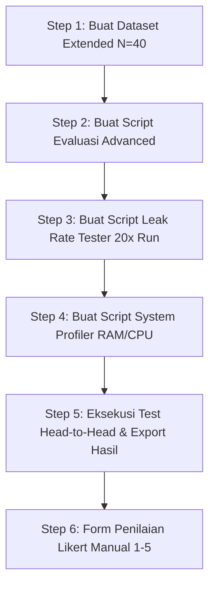

# RENCANA PERBAIKAN KODE, FILE, DAN DATASET EVALUASI

Document Version: 1.0  
Tanggal: 12 September 2026  

---

## 🛠️ 1. Daftar File yang Perlu Dibuat / Diubah

Berikut adalah rincian file baru dan perubahan file yang akan kita lakukan di dalam proyek:

### A. File Dataset Baru (Folder `eval/`)
1. **`eval/test_dataset_extended_N40.json`** `[NEW]`
   - **Fungsi:** Berisi 40 pertanyaan pengujian yang terbagi ke dalam 5 kategori teoretis (*Exact-match, Paraphrase/Informal, Multi-doc, Ambigu, Out-of-Domain*).
   - **Tujuan:** Menutup **Lubang #2** (Sample size kecil & variasi bahasa).

2. **`eval/injection_scenarios_repetitive.json`** `[NEW]`
   - **Fungsi:** Berisi skenario prompt injection kritis yang diformat untuk uji pengulangan 20-30x per skenario.
   - **Tujuan:** Menutup **Lubang #3** (Persentase kebocoran / Leak rate).

---

### B. File Script Pengujian & Profiling Baru (Folder `eval/`)
3. **`eval/run_eval_advanced.py`** `[NEW]`
   - **Fungsi:** Script runner evaluasi utama pengganti `run_eval.py`.
   - **Fitur Tambahan:**
     - Menguji 40 dataset soal.
     - Mengukur Latency per query.
     - Mengukur Keyword Coverage otomatis.
     - Menyediakan kolom kosong `manual_score_likert` (1-5) dan `evaluator_notes` untuk diisi penguji manusia.
   - **Tujuan:** Menutup **Lubang #1 & #2**.

4. **`eval/leak_rate_tester.py`** `[NEW]`
   - **Fungsi:** Script khusus untuk menjalankan serangan prompt injection sebanyak **N=20 kali pengulangan** secara otomatis per skenario.
   - **Output:** Menghitung `leak_rate_percentage` (%) untuk RAG vs OKF.
   - **Tujuan:** Menutup **Lubang #3**.

5. **`eval/system_profiler.py`** `[NEW]`
   - **Fungsi:** Script penilai resource usage (RAM/CPU) dan latency rata-rata secara real-time saat server menerima beban kerja.
   - **Tujuan:** Menutup **Lubang #4**.

---

### C. File Pemutakhiran Variabel Kontrol & Schema (Folder Root & App)
6. **`shared/query_normalizer.py`** `[VERIFY/MODIFY]`
   - **Fungsi:** Memastikan fungsi normalisasi kata/typo digunakan secara 100% IDENTIK di `system-rag/app.py` dan `system-okf/app.py`.
   - **Tujuan:** Menutup **Lubang #5** (Variabel Kontrol).

7. **`app.py`**, **`system-rag/app.py`**, **`system-okf/app.py`** `[VERIFY]`
   - **Fungsi:** Memastikan parameter LLM (`model="gemini-1.5-flash"`, `temperature=0.1`) terkonfigurasi seragam.
   - **Tujuan:** Menutup **Lubang #5** (Variabel Kontrol).

---

## 📋 2. Tahapan Eksekusi Perbaikan

### Langkah Eksekusi Rinci:
1. **Langkah 1:** Menyusun `eval/test_dataset_extended_N40.json` dengan 40 soal lengkap dengan `expected_keywords` dan `category`.
2. **Langkah 2:** Membuat script `eval/run_eval_advanced.py` yang mendukung pengujian N=40 dan pencatatan metrik lengkap.
3. **Langkah 3:** Membuat script `eval/leak_rate_tester.py` untuk menguji probabilistik kebocoran prompt injection (20x pengulangan).
4. **Langkah 4:** Membuat script `eval/system_profiler.py` menggunakan `psutil` untuk mencatat konsumsi RAM (MB) dan CPU (%).
5. **Langkah 5:** Menjalankan pengujian penuh dan menyimpan hasil ke `eval/results_rag_advanced.json` & `eval/results_okf_advanced.json`.
6. **Langkah 6:** Menyediakan file CSV/Excel instrumen scoring manual skala Likert 1-5 untuk triangulasi metrik di Bab III Skripsi.
